  

---

---
━━━━━━━━━━━━━━━━━━━━━━━━━━━━━━━━━━━━━━━━━━━━━━

━━━━━━━━━━━━━━━━━━━━━━━━━━━━━━━━━━━━━━━━━━━━━━

## 📌 О проекте

**Habit Tracker** — персональное веб-приложение для формирования и отслеживания полезных привычек. Главный фокус сделан на **визуальный WOW-эффект** и **мотивацию** через геймификацию, плавные анимации и позитивное подкрепление.

---

## 🎯 Решаемая задача

**Проблема:** Людям (и особенно детям) сложно формировать регулярные привычки, так как большинство трекеров выглядят скучно и не дают эмоциональной отдачи.

**Решение:** Создать красивый, интуитивный и мотивирующий инструмент, который:
- Визуально показывает прогресс (календарь, статистика)
- Мотивирует через позитивные сообщения и анимации (например, конфетти при успехе)
- Позволяет категоризировать задачи
- Работает без регистрации, сохраняя данные локально в браузере

---

## 👥 Целевая аудитория

- 👦 **Школьники и дети** — для формирования полезных ежедневных ритуалов (чтение, зарядка, уборка, выполнение домашних заданий) в понятной и игровой форме.
- 🎓 **Студенты** — для отслеживания учебных привычек (изучение языков, решение задач).
-  **Спортсмены и ЗОЖ-энтузиасты** — для регулярных тренировок и здоровых привычек.
- 💼 **HR и рекрутеры** — как пример качественного и современного frontend-проекта в портфолио.

---

## ✨ Возможности

### Основной функционал
- ✅ Добавление и удаление привычек
- ✅ Отметка выполнения с визуальной обратной связью
- ✅ Категории:  Здоровье, 📚 Учёба,  Спорт, 🧠 Развитие
- ✅ Сохранение данных в LocalStorage
- ✅ Календарь выполнения на 3 месяца
- ✅ Поиск и фильтрация по категориям

### Дизайн и фишки
- 🌈 Яркий градиентный дизайн + эффект glassmorphism
- 🌓 Переключение тёмной и светлой темы
- 🎉 Анимация конфетти при 100% выполнении дневных целей
- 💪 Мотивационные сообщения, когда задачи не выполнены или всё сделано
-  Полная адаптивность под мобильные устройства

### Статистика
- 📈 Процент выполнения задач
- 🔥 Счётчик непрерывных серий (streak)
- 📅 Визуальный календарь с цветовой индикацией
- 📊 Прогресс-бары для наглядности

---

## 🛠 Как реализовано

| Компонент | Технология |
|-----------|------------|
| **Интерфейс** | React 18 + хуки (useState, useEffect) |
| **Стили** | Tailwind CSS 3 (утилитарный подход) |
| **Сборка** | Vite 5 (быстрый dev-сервер) |
| **Хранение** | LocalStorage (данные в браузере) |
| **Анимации** | CSS transitions + canvas-confetti |
| **Даты** | Нативный JavaScript Date API |

---

## 📸 Скриншоты

---

## 🌐 Демо

**Live Demo:** [ваш-username.github.io/habit-tracker](https://ваш-username.github.io/habit-tracker)

---

## 👤 Автор

**Дмитрий Ширяев**  
Frontend Developer

- GitHub: [@ваш-username](https://github.com/ваш-username)

---

**Сделано с ❤️**

⭐ **Поставьте звезду репозиторию, если проект вам понравился!**

